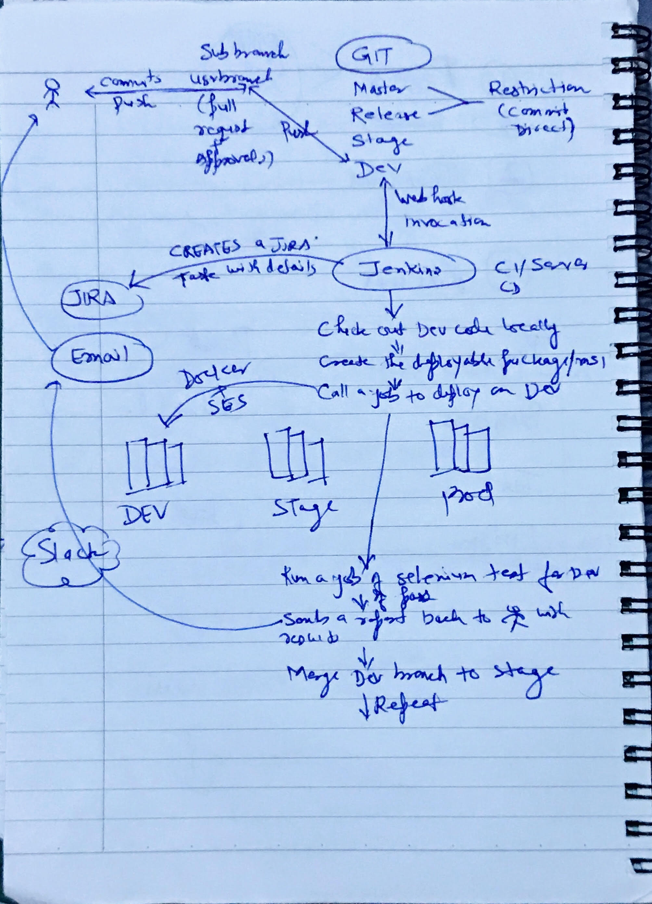

# ci-cd-pipeline
This is a sample ci cd pipeline code for a java based application

Jenkins URL: http://3.80.248.206:8080/

Add following rules in aws security group:

HTTP/8081/101.127.5.208/32
SSH/22/101.127.5.208/32

sudo yum instal git
sudo yum install java
sudo yum install docker
systemctl enable docker
sudo usermod -a -G docker $USER

code_repo/.mvnw
----------------------------------------------------------
	Application 'UMSL' is running! Access URLs:
	Local: 		http://localhost:8081/services/UMSL
	External: 	http://172.31.34.233:8081/services/UMSL
	Profile(s): 	[dev, swagger]
----------------------------------------------------------

High level architecture:

##Continuous integration/Deployment sketch (thought process)

##Continuous integration

##Continuous Deployment

